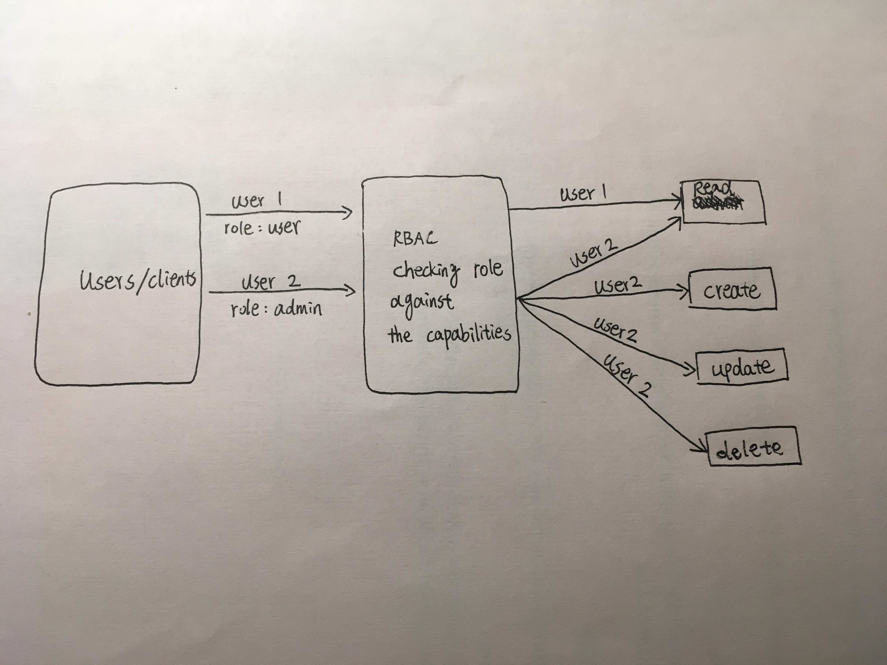

# LAB - 14

## Access Control

### Author: David Zheng 

### Links and Resources
* [submission PR](https://github.com/davidzheng-401d32/lab-14/pull/1)
* [travis](https://travis-ci.com/davidzheng-401d32/lab-14)
* [back-end](https://davidzheng-lab14.herokuapp.com) 
#### Documentation
* [jsdoc](https://davidzheng-lab14.herokuapp.com/docs) (Server assignments)

### Setup
#### `.env` requirements
* `PORT` - 3000
* `MONGODB_URI` - mongodb://localhost:27017/db
* `SECRET`

#### Running the app
* `npm start`.
  
#### Tests
* lint test: `npm run lint`
* unit test: `npm test`

#### UML

